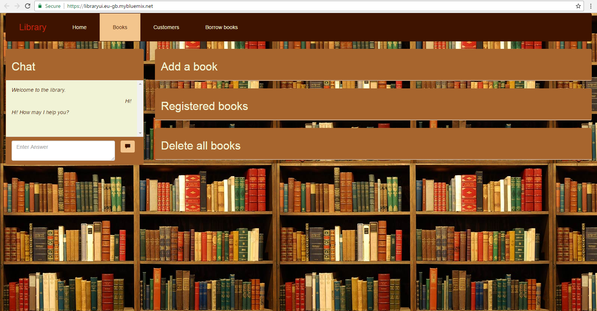

# Library application

This is a sample application running on IBM Bluemix. It allows you to store, delete and update books and customers and register borrowed books.

It includes the Watson Conversation Service as well as the TextToSpeech Service.

To run the app, please create an instance of a Cloudant NoSQL Database, a Conversation Service and a TextToSpeech Service.

**View the app [here](https://libraryui.eu-gb.mybluemix.net/).**

**Find the Java backend in this repository: [https://github.com/florae123/library-server-java](https://github.com/florae123/library-server-java).**

**Find the Node.js server and the web interface here: [https://github.com/florae123/Libraryui](https://github.com/florae123/Libraryui).**

You will also be provided with step-by-step instructions on how to deploy the library app to Bluemix.

**Watch the video on YouTube for further information about this application: [https://www.youtube.com/watch?v=NqF2wIMBqBw](https://www.youtube.com/watch?v=NqF2wIMBqBw).**

## Architecture

A microservice-based architecture: The node.js server interacts with the Watson services and with the java server. The database is accessed from the java server.

